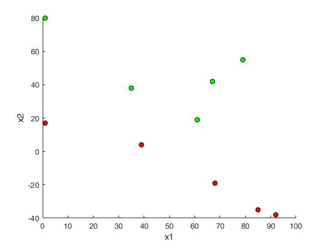
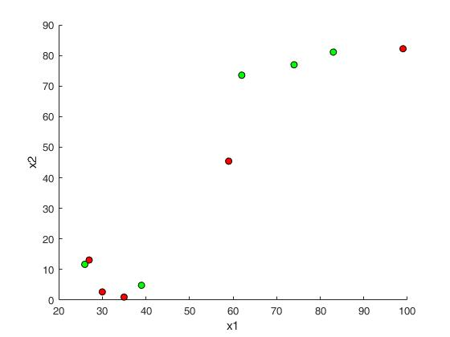
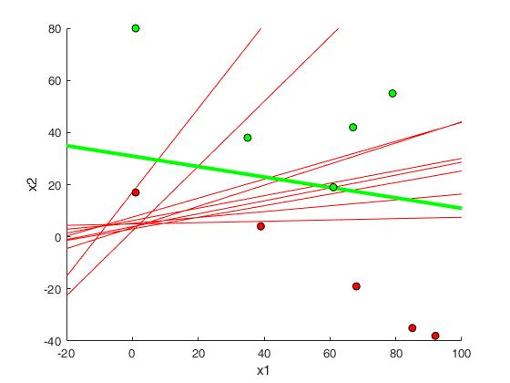
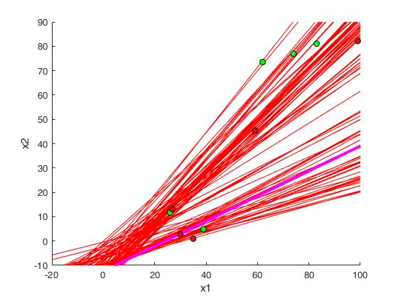

# Perceptron Learning Algorithm in MatLab
This is the MatLab implementation of the popular basic classification 
algorithm known as Perceptron Learning Algorithm(PLA)

The purpose is to show how PLA converges to its final hypothesis

* For a linearly seperable dataset PLA converges to one final hypothesis 
with perfectly classified classes
* For a linearly inseperable dataset PLA does not converge to any 
hypothesis and we choose the hypothesis we are finally at

## Running the code
### Linearly seperable
* In the [main.m](main.m) file change the 'type' variable to 1 to create
linearly seperable points
* Change 'numpoints' variable to the number of datapoints to be taken
* In the MatLab command line run the command
  ```bash
  main.m
  ```

### Linearly inseperable
* In the [main.m](main.m) file change the 'type' variable to 0 to create
linearly inseperable points
* Change 'numpoints' variable to the number of datapoints to be taken
* In the MatLab command line run the command
  ```bash
  main.m
  ```

## Result
### Linearly seperable


The PLA converges to a hypothesis in case of linearly seperable. The final 
hypothesis division is represented by the green line.

### Linearly inseperable


The PLA does not converge in case of linearly inseperable, the magenta 
line represents the final hypothesis achieved after 5000 steps


